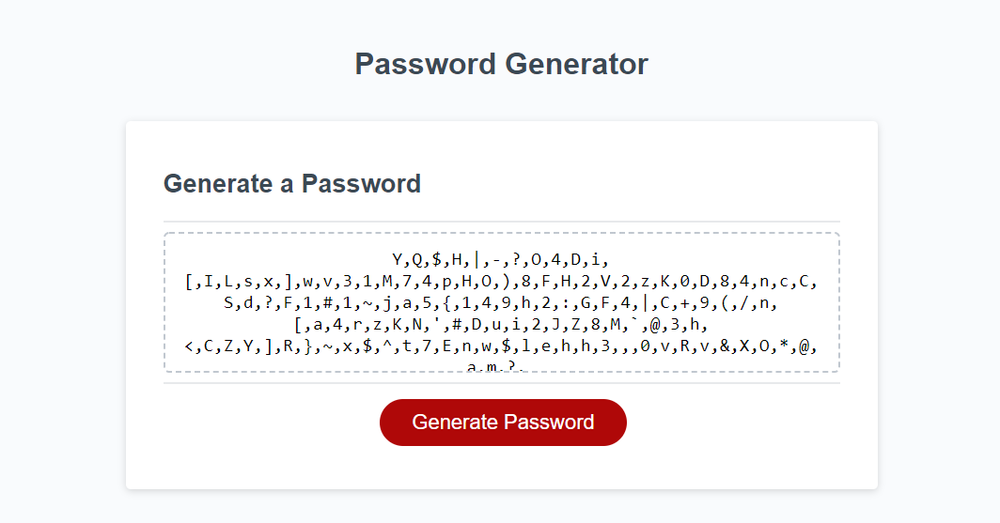

# Password Generator

A webpage that uses JavaScript to generate a randomized password of a length determined by user input, containing character types determined by user input.

Characters can be lowercase letters, uppercase letters, numeric characters, or special characters, and at least one character type must be confirmed.
Password length must be at least 8 characters and no more than 128 characters.

Link to deployed application:
https://connermart.github.io/module3challenge-passwordgenerator/
